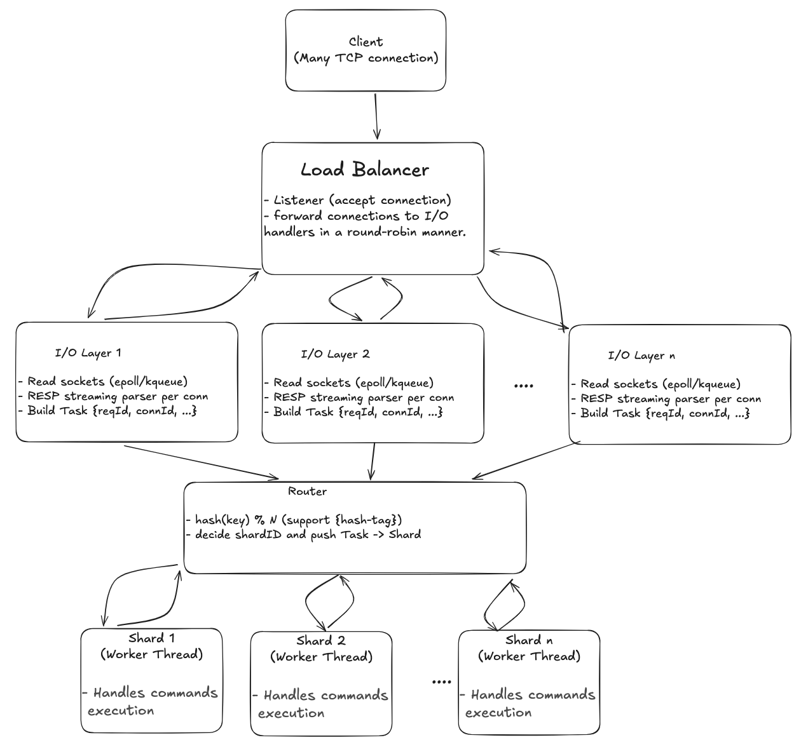

<!-- Improved compatibility for back-to-top link -->
<a id="readme-top"></a>

<!-- PROJECT HEADER -->
<div align="center">
  <h3 align="center">Multithreaded In-Memory Database</h3>

  <p align="center">
    High-performance, multi-threaded in-memory database like Redis, written in Go.
  </p>
</div>

---

## 📘 Description

**Multithreaded In-Memory Redis** is a high-performance, Redis-compatible in-memory database built entirely in **Golang**.  
Unlike the traditional single-threaded Redis architecture, this project introduces a **multi-threaded design** that fully utilizes **multi-core CPUs** for parallel command execution, efficient I/O multiplexing, and high scalability.

This architecture ensures extremely low latency and high throughput, even under heavy concurrent workloads.

<div align="center">
  
  <p><em>System Architecture Overview</em></p>
</div>

---

## ⚡ Benchmarks

### ⚙️ Test Environment

| Parameter        | Value                     |
|------------------|---------------------------|
| CPU Cores        | 8                         |
| Benchmark Host   | `127.0.0.1` (localhost)   |
| Multi-threaded DB| `1234`                    |
| Redis Port       | `6379`                    |

---

### 🔹 Benchmark 1: **SET Command**

#### Command
```bash
./redis/src/redis-benchmark -p 1234 -t set -n 500000 -r 500000 --threads 4
```

#### Results

| System | Throughput (req/s) | Avg Latency (ms) | P50 | P95 | P99 | Max |
|--------|--------------------|------------------|-----|-----|-----|-----|
| **Multi-threaded In-Memory DB** | **83222.38** | 0.556 | 0.567 | 0.647 | 0.855 | 10.767 |
| **Redis (Single-threaded)**     | **71357.21** | 0.653 | 0.639 | 0.919 | 1.063 | 3.671 |

---

### 🔹 Benchmark 2: **GET Command**

Command
```bash
./redis/src/redis-benchmark -n 500000 -t get -h 127.0.0.1 -p 1234 -r 500000 --threads 4
```

Results

| System | Throughput (req/s) | Avg Latency (ms) | P50 | P95 | P99 | Max |
|--------|--------------------|------------------|-----|-----|-----|-----|
| **Multi-threaded In-Memory DB** | **79872.20** | 0.570 | 0.575 | 0.639 | 0.783 | 14.575 |
| **Redis (Single-threaded)**     | **79923.27** | 0.593 | 0.591 | 0.823 | 0.911 | 2.879 |

---

### 🔹 Benchmark 3: **ZADD Command**

Command
```bash
./redis/src/redis-benchmark   -n 500000   -r 10000   -p 1234   --threads 4   "ZADD" "zset:__rand_int__" "__rand_int__" "member:__rand_int__"
```

Results

| System | Throughput (req/s) | Avg Latency (ms) | P50 | P95 | P99 | Max |
|--------|--------------------|------------------|-----|-----|-----|-----|
| **Multi-threaded In-Memory DB** | **79850.95** | 0.577 | 0.583 | 0.687 | 1.239 | 6.279 |
| **Redis (Single-threaded)**     | **66592.67** | 0.726 | 0.703 | 1.039 | 1.207 | 3.095 |

---

### 🔹 Benchmark 4: **ZRANGE Command**

Command
```bash
./redis/src/redis-benchmark   -n 500000  -r 10000   -p 1234   --threads 4   "ZRANGE" "myzset:__rand_int__" "0" "-1"
```

Results

| System | Throughput (req/s) | Avg Latency (ms) | P50 | P95 | P99 | Max |
|--------|--------------------|------------------|-----|-----|-----|-----|
| **Multi-threaded In-Memory DB** | **79872.20** | 0.576 | 0.583 | 0.679 | 0.927 | 17.359 |
| **Redis (Single-threaded)**     | **76852.13** | 0.612 | 0.599 | 0.855 | 1.039 | 2.775 |


---

### 📊 Summary Comparison

| Command | Metric | Multi-threaded DB | Redis | Improvement |
|----------|---------|------------------|--------|--------------|
| **SET** | Throughput | 83222.38 req/s | 71357.21 req/s | **+15%** |
| **GET** | Throughput | 79872.20 req/s | 79923.27 req/s | ≈ Same |
| **ZADD** | Throughput | 79850.95 req/s | 66592.67 req/s | **+20%** |
| **ZRANGE** | Throughput | 79872.20 req/s | 76852.13 req/s | ≈ Same |

---


## ⚙️ Installation
### 🔧 Requirements
* Go 1.21 or higher
* Linux / macOS (for epoll/kqueue support)
* Redis CLI for benchmarking (optional)


### 🧩 Clone the project

```bash
git clone https://github.com/duykien1310/Multithreaded-In-Memory-Database.git
cd Multithreaded-In-Memory-Database
```

### 🏗️ Build from source

```bash
# To build for your local platform
go run cmd/app/main.go
```

### 🧪 Test with Redis CLI

```bash
redis-cli -p 1234
```

#### Example:
```bash
SET hello world
GET hello
ZADD myzset 1 one 2 two
ZRANGE myzset 0 -1 WITHSCORES
```
